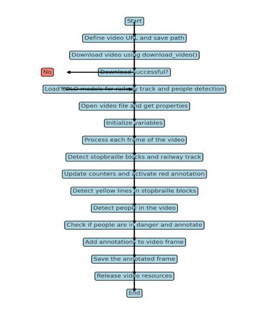

# Metro Safety System

### Project Overview
This project is part of the Digital Egypt Pioneers Initiatives (DEPI) graduation project within the Microsoft Machine Learning course. The "Metro Safety System" is designed to enhance the safety of subway passengers by monitoring platform activity in real-time. The system analyzes video streams from subway surveillance cameras, detecting both people on the platform and the safety yellow line. 

When a person touches or crosses the yellow line, the system triggers an alert to notify security personnel. This enables them to quickly review the situation and take immediate action to prevent potential accidents. By providing real-time awareness of dangerous scenarios, the system aims to reduce accidents and suicides, creating a safer environment for all passengers.

---
## Table of Contents
- [Datasets Used](#datasets-used)
- [Methodology](#methodology)
- [Key Features](#key-features)
- [Flow Chart](#flow-chart)
- [Sample Output](#sample-output)

---

## Datasets Used

We trained our model using two datasets from Roboflow:

1. **Station Platform and Detecting Braille Blocks 2**  
   - **Link:** [Station Platform Dataset](https://universe.roboflow.com/hakujou/station-platform-and-detecting-braille-blocks-2/browse?queryText=&pageSize=200&startingIndex=0&browseQuery=true)  
   - Contains four classes: railway track, braille blocks, platform, and stop braille blocks.  
   - For our project, we focused on the `railway track` and `stop braille blocks` classes to define the safety zone boundaries.

2. **Person Dataset**  
   - **Link:** [Person Dataset](https://universe.roboflow.com/abner/person-hgivm/browse?queryText=&pageSize=50&startingIndex=50&browseQuery=true)  
   - Contains a single class: `person`.  
   - This dataset is essential for detecting individuals on the subway platform, ensuring accurate monitoring of human activity.

---

## Methodology

We utilized two YOLO v8m models after testing various models and sizes to achieve the best accuracy:

1. **Yellow Line Detection Model**  
   - Detects the yellow line specifying the danger zone on the platform.  
   - Also detects the railway tracks.
   - [Download the Model](https://drive.google.com/file/d/1M6GHJ5H20U05_p97rRAC2T-F0R4-eDSa/view?usp=sharing) 

2. **Person Detection Model**  
   - Trained on a well-annotated person dataset to handle complex scenarios accurately.
   - [Download the Model](https://drive.google.com/file/d/1M6GHJ5H20U05_p97rRAC2T-F0R4-eDSa/view?usp=sharing) 

After obtaining predictions from the models, the following processes are applied:

- **Yellow Line**: We use a hybrid algorithm combining color segmentation and masking, within the bounding box area to determine the exact location of the yellow line. This returns the start and end points of the line.
  
- **Railway**: This annotation is used to:
  - Detect if a train is present at the station.
  - Identify the platform's position to specify which side of the station is dangerous.

- **Person**: Person detection is critical due to complex scenarios. We apply thresholds and algorithms to accurately identify the foot position of individuals for high accuracy.

---

## Key Features

- **Handling Unclear Yellow Line Detection:**
  - A variable saves the last known yellow line coordinates when the line can't be clearly detected.
- **Comprehensive Masking for Metro Platforms:**
  - A large masking range is applied to cover most metro platform line colors, with auto-completion using the detected start and end points.
- **Railway Detection Validation:**
  - A condition ensures the railway is considered real only if detected in 3 consecutive frames, reducing false positives.
- **Alert System Output:**
  - Red Annotation: Persons detected in the danger zone are marked with a red border.
  - Counter: A counter updates frame by frame, tracking the number of persons in the danger zone.
---
## Flow Chart

---

## Sample Output

## Documentation
Interested in the project? Checkout more details!

- [Presentation](https://drive.google.com/drive/folders/1CTP7GL4nwLywcukLlpK0KQSVYToG9aAI?usp=sharing)
- [Report](https://drive.google.com/drive/folders/194bJ089a_wWlBNDJbax_A8bnjd0v3FPf?usp=sharing)
- [Process of creating virtual machine on azure](https://drive.google.com/drive/folders/1kXDg1Urx6OKXyHZHbJqbYyMaAo08R5oQ?usp=sharing)  

